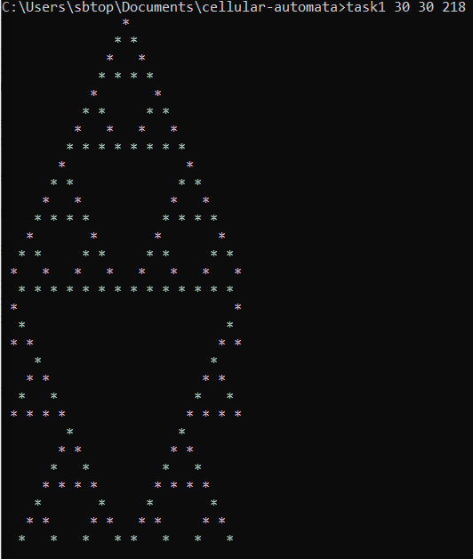

# cellular-automata
Implementation of Cellular Automata, which have many uses in computational biology.

Program takes three values from the user as command line arguments. These values are:

- number of cells in the one-dimensional grid (a positive integer)
- number of generations to evolve and output the cellular automata for (a positive integer)
- Wolfram code specifying which the rule set to evolve your cellular automata with (an integer in the range [0,255]).

Please see the image below for an example:



Dynamic memory allocation was used in this implementation and has been confirmed using valgrind that the program produces no memory leaks. 

Sources:
- https://en.wikipedia.org/wiki/Cellular_automaton
- http://mathworld.wolfram.com/ElementaryCellularAutomaton.html

## Executing the Program
To run the program, please pull this repo and navigate to the directory, then enter command:

```task1 [number of cells] [number of generations] [wolfram code]```
